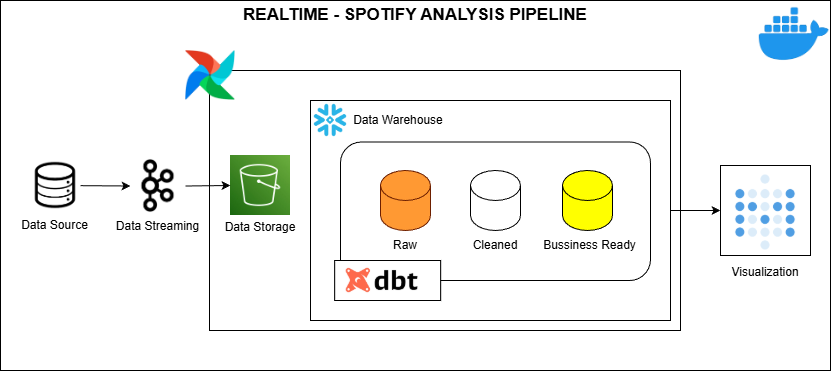
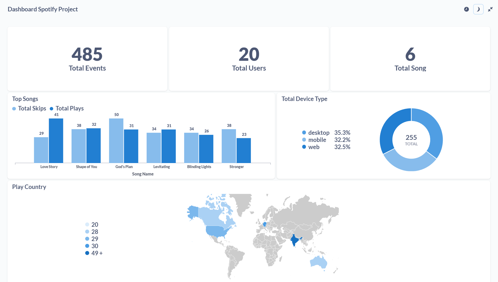

# 🎧 Spotify Modern Data Stack Project


---

## 🏗️ Architecture



**Pipeline Flow:**

1. **Data Simulator** → Generates fake Spotify streaming data (user, track, region, device).
2. **Kafka Producer** → Streams the data to Kafka topics in real time.
3. **Kafka Consumer** → Consumes and stores the raw data into **MinIO (S3-compatible storage)**.
4. **Airflow** → Orchestrates data loading from MinIO → Snowflake (Bronze).
5. **Snowflake** → Stores and manages data in **Bronze → Silver → Gold layers**.
6. **DBT** → Cleans, transforms, and builds analytics-ready models directly inside Snowflake.
7. **Metabase** → Connects to the Snowflake Gold tables for **interactive dashboards and insights**.

---

## ⚡ Tech Stack

- **Python (Faker)** → Data simulation
- **Apache Kafka** → Real-time data streaming
- **MinIO** → Object storage (S3-compatible)
- **Snowflake** → Cloud data warehouse
- **DBT** → Transformations, tests, and models
- **Apache Airflow** → Orchestration and DAG scheduling
- **Metabase** → Business intelligence dashboard
- **Docker & docker-compose** → Containerized environment

---

## ✅ Key Features

- **Fully automated pipeline** — end-to-end from ingestion to insights
- **Real-time streaming** using Kafka
- **Medallion Architecture (Bronze → Silver → Gold)** implemented in Snowflake
- **DBT for transformation and testing** (clean, modular SQL models)
- **Power BI dashboard** showing region-wise plays, song trends, and listener insights
- **Containerized deployment** for reproducibility
- **CI/CD pipeline** with dbt test automation

---

## 📂 Repository Structure

```text
REALTIME-SPOTIFY-PROJECT/
├── dags/
│ ├── **pycache**/
│ ├── .env
│ └── minio-to-kafka.py
│
├── image/
│ ├── Architectur.png
│ └── dashboard.png
│
├── include/
│ ├── consumer/
│ │ ├── .env
│ │ ├── kafka-to-minio.py
│ │ └── logs/
│ │
│ ├── dbt/
│ │ └── spotify_dbt/
│ │ └── model
│ └── metabase-data/
│ ├── metabase.db
│ ├── metabase.db.mv.db
│ └── metabase.db.trace.db
│
├── simulator/
│ ├── .env
│ └── producer.py
│
├── plugins/
│
├── venv/
│
├── .env
├── .gitignore
├── docker-compose.yml
├── README.md
└── requirements.txt
```

## ⚙️ Step-by-Step Implementation

### 1. Data Simulation

- Generated fake **Spotify streaming data** using **Python + Faker**.
- **Data fields:** `user_id`, `track_name`, `artist`, `region`, `device_type`, `timestamp`, `duration`.
- Simulated a **continuous stream of song plays**.

---

### 2. Kafka Streaming

- Used **Kafka Producer** to send data into Kafka topics in real-time.
- Each message represents a **song play event**.
- **Kafka Consumer** stores these events as **raw JSON files in MinIO**.

---

### 3. Airflow Orchestration

- **DAG 1:** Loads raw data from **MinIO → Snowflake Bronze tables**.
- **DAG 2:** Triggers **DBT transformation runs** to build **Silver** and **Gold** models.

---

### 4. Snowflake Data Warehouse

- **Bronze Layer:** Raw data ingested directly from MinIO.
- **Silver Layer:** Cleaned and standardized data.
- **Gold Layer:** Aggregated insights such as:
  - Top artists
  - Most-streamed regions
  - Device usage

---

### 5. DBT Transformations

- **Staging models:** Clean column names, handle nulls, standardize timestamps.
- **Marts:**
  - **Facts:** plays, listeners
  - **Dimensions:** tracks, artists, devices, regions
- Automated tests and documentation via:
  - `dbt test`
  - `dbt docs generate`

---

### 6. Visualization in Metabase

- Connected directly to **Snowflake Gold layer**.


